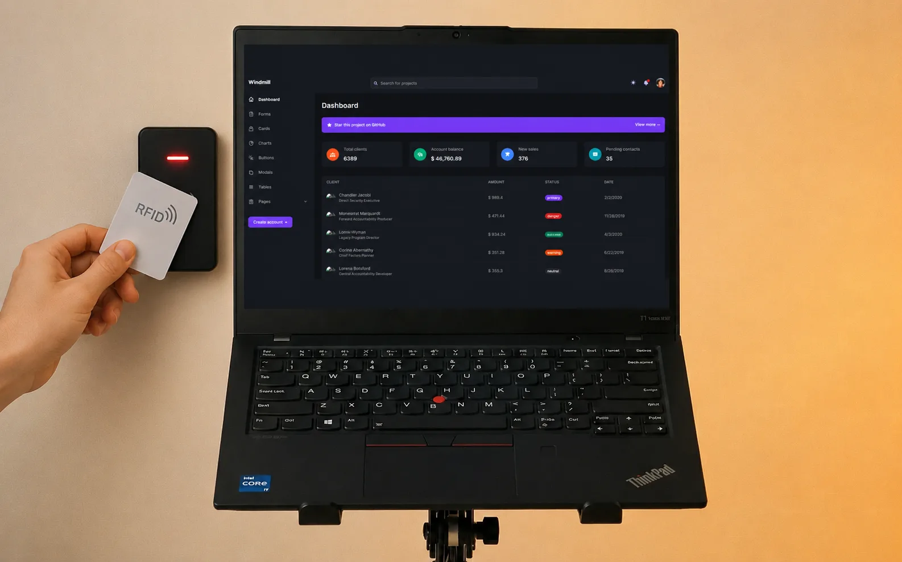

# RFID Smart Lock System

An access-control system for a door: tap an RFID card, the lock decides, and every attempt lands in a web dashboard where an admin manages who is allowed in.



## How it works

```
 RFID card ──► RC522 reader ──► ESP32 / ESP8266 ──► Django API ──► React admin dashboard
                                   │                    │
                              lock + LED/buzzer     users, cards, access logs
                                feedback
```

- **Hardware** — an RC522 reader on an ESP32/ESP8266 reads the card UID, drives the lock and gives instant feedback (granted / denied).
- **Backend** — Django checks the UID against registered users and records every attempt.
- **Dashboard** — admins add or revoke users and cards, and review the access log remotely.

## This repository

This repo holds the **admin dashboard front-end** (React + Tailwind CSS). It was started from the open-source [Windmill Dashboard React](https://github.com/estevanmaito/windmill-dashboard-react) template (MIT © Estevan Maito), which provides the layout, theming and UI components.

```bash
npm install
npm start        # dev server on http://localhost:3000
npm run build    # production build
```

## Stack

ESP32 · ESP8266 · RFID RC522 · Django · React · Tailwind CSS · JavaScript

## More

- Project presentation on [LinkedIn](https://www.linkedin.com/posts/mohamed-aziz-guenni_rfid-smart-lock-system-presentation-activity-7274871227628896256-7y19)
- [My portfolio](https://azyzex.github.io/AzyzPortfolio/)

## License

MIT — see [LICENSE](LICENSE) (template copyright retained).
